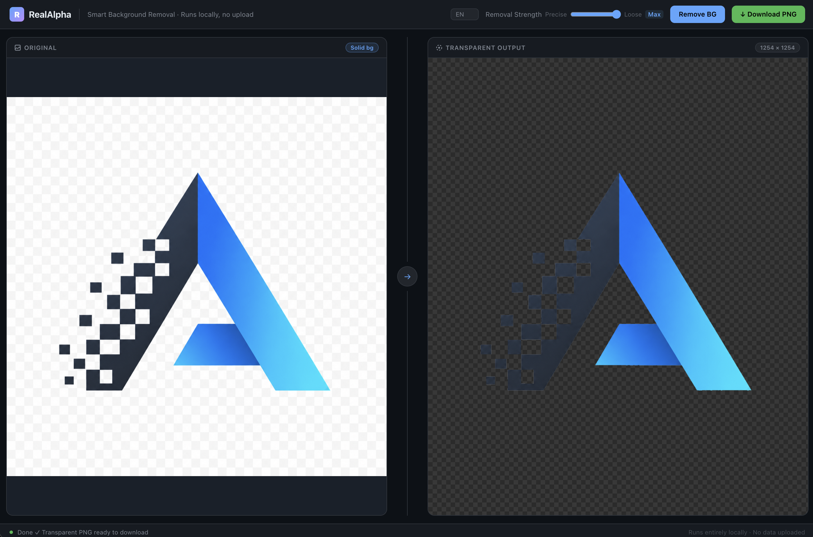

# RealAlpha

**RealAlpha converts AI-generated images with fake transparency into real PNGs with alpha transparency.**  
把 AI 生成的假透明图片，变成真正带 Alpha 通道的透明 PNG。

> Part of [AhaKnow Tool Lab](https://github.com/IHKYoung) — turning real problems into small, shippable tools.  
> 凡所思，皆可造。



---

## Try it online

👉 [realalpha.ahaknow.com](https://realalpha.ahaknow.com)

**No upload. No account. No API key.**  
Everything runs locally in your browser.

---

## Why RealAlpha?

AI image tools sometimes generate images that *look* transparent, but are actually exported with:

- a white canvas
- a baked-in checkerboard background
- no real alpha channel

RealAlpha helps turn those fake-transparent images into real transparent PNGs.

---

## Features

- Drop, click, or paste to upload
- Detects solid-color and checkerboard backgrounds
- Removes enclosed fake-transparent areas, such as holes inside rings
- Adjustable removal strength
- Local browser processing
- English / 中文 / 日本語 / 한국어

---

## Run locally

```bash
npm install
npm run dev
````

Build for production:

```bash
npm run build
```

---

## How it works

RealAlpha detects likely fake-transparent backgrounds from image borders, removes matching background regions, and applies light feathering around transparency edges.

It also handles enclosed background areas that simple edge flood-fill methods may miss.

---

## Built by

[Clarke Young](https://github.com/IHKYoung) · [AhaKnow](https://github.com/ahaknow)

---

## License

MIT

